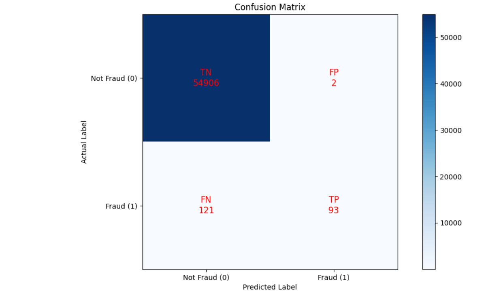
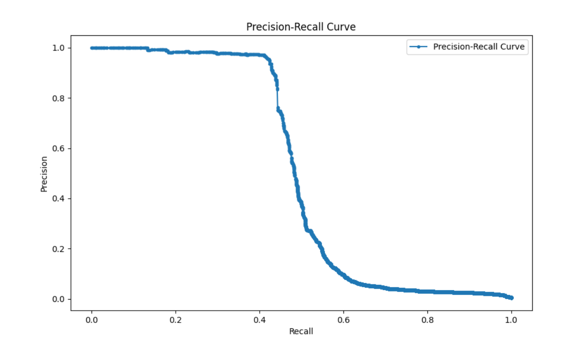

# Real-Time Fraud Detection System 
Built with Kafka, PySpark, Airflow, MLflow, XGBoost, Redis, FastAPI, and More

This repo contains an end-to-end real-time fraud detection pipeline that I designed, engineered, and deployed — achieving a precision of **98%**. It’s designed for high-throughput environments and inspired by real-world patterns of financial fraud (account takeovers, card testing, merchant collusion, and geographic anomalies). The model is also served via FastAPI to allow for real-time predictions on incoming transactions.

---

## System Overview

The project consists of:

| Component              | Tech                                       | Role                                                                 |
|------------------------|--------------------------------------------|----------------------------------------------------------------------|
| **Data Ingestion**     | Kafka, Faker                               | Streams realistic financial transactions                             |
| **Model Training**     | XGBoost, Optuna, scikit-learn, MLflow      | Trains a fraud classifier with feature engineering and threshold tuning |
| **Real-Time Inference**| PySpark, Redis, Kafka                      | Applies the trained model on live transaction streams                |
| **Scheduling & Orchestration** | Airflow                         | Triggers daily model retraining with resource cleanup                |
| **Feature Store**      | Redis                                      | Stores rolling aggregates (e.g. activity, transaction history) for real-time lookup |
| **Prediction API**     | FastAPI, Redis, SQLAlchemy, XGBoost        | Serves fraud predictions on incoming transactions via REST API       |

---

## Model Performance

- **Precision:** 98%
- Tuned with **Optuna** for optimal `F-beta` (β=2)
- Uses **SMOTE** for class imbalance
- **Top features:** `amount`, `user_activity_24h`, `amount_to_avg_ratio`, `merchant_risk`, `merchant`

- **Confusion Matrix:**
    

- **Precision-recall curve:**
    
---

## Key Features

- **Feature Engineering:**  
  Behavioral, temporal, statistical, and merchant-based — including:
  - Transaction burst patterns
  - Night/weekend behavior
  - Location mismatch & anomalies
  - Personalized rolling stats (e.g. z-score, velocity, spending patterns)

- **Stream-Scale Architecture:**  
  - Built-in backpressure tolerance
  - Kafka ➝ PySpark ➝ Redis ➝ Kafka (fraud predictions topic)

- **ML Model Deployment:**  
  - Logged with MLflow  
  - Stored with `joblib`  
  - Reused via broadcast variables in Spark
  - Served via a FastAPI backend to return fraud predictions for incoming transactions through a REST API

- **Built-In Simulation Engine:**  
  - Faker-powered transaction generator
  - 4 custom fraud generation patterns for realism
  - JSON schema validation included

---

## File Structure

```
fraud_detection/
├── airflow/
│   ├── Dockerfile
│   └── requirements.txt
│
├── api/
│   └── app/
│       ├── __pycache__/
│       ├── main.py
│       ├── database.py
│       ├── models.py
│       ├── predict.py
│       ├── kafka_consumer.py
│       ├── __init__.py
│       ├── utils/
│       │   └── redis_utils.py
│       └── routers/
│           ├── predict.py
│           ├── transactions.py
│           └── users.py
│
├── config/
│   └── airflow.cfg
│
├── dags/
│   ├── __pycache__/
│   ├── fraud_detection_training.py
│   └── fraud_detection_training_dag.py
│
├── inference/
│   ├── Dockerfile
│   ├── main.py
│   ├── redis_utils.py
│   └── requirements.txt
│
├── logs/
│   ├── dag_id=fraud_detection_training/
│   ├── dag_processor/
│   ├── dag_processor_manager/
│   └── scheduler/
│
├── mlflow/
│   ├── Dockerfile
│   └── requirements.txt
│
├── models/
│   └── fraud_detection_model.pkl
│
├── producer/
│   ├── Dockerfile
│   ├── main.py
│   └── requirements.txt
│
├── .env
├── README.md
├── config.yaml
├── docker-compose.yaml
├── init-multiple-dbs.sh
└── wait-for-it.sh

```

---

## Tech Stack

- **Data Streaming:** Kafka
- **Modeling:** XGBoost, Optuna, scikit-learn, SMOTE
- **Streaming Compute:** PySpark
- **Prediction API:** FastAPI
- **Scheduling:** Airflow
- **Feature Store:** Redis
- **Tracking:** MLflow
- **Logging:** Python Logging module
- **Serialization:** Joblib
- **Infrastructure:** MinIO (S3-compatible), Docker

---

## To Run the Project

> Requires Docker + Kafka + Redis + Airflow (docker-compose recommended)

1. Set up `.env` and `config.yaml` (see the tempate in `config.yaml`)
2. Start all services (Kafka, Redis, Airflow, MinIO, Producer (for transactions to Produce in Kafka), Inference) with docker-compose
3. Trigger training manually or wait for Airflow:
    ```bash
    airflow dags trigger fraud_detection_training
    ```
4. (Optional as starting Docker will also run inference): Run the Spark-based inference (locally):
    ```bash
    cd inference/
    python main.py
    ```
5. Access FastAPI docs to test predictions manually:
    ```bash
    http://localhost:8000/docs
    ```
   
---

## Example Fraud Patterns Simulated

- Account Takeover
- Card Testing
- Merchant Collusion
- Geo-Anomaly Fraud

---

## Author

**Jasjot Parmar**  
Aspiring Data Engineer | Python & SQL Enthusiast | Curious Storyteller  

🔗 [GitHub](https://github.com/jasjotp) • [LinkedIn](https://www.linkedin.com/in/jasjotparmar)

---

